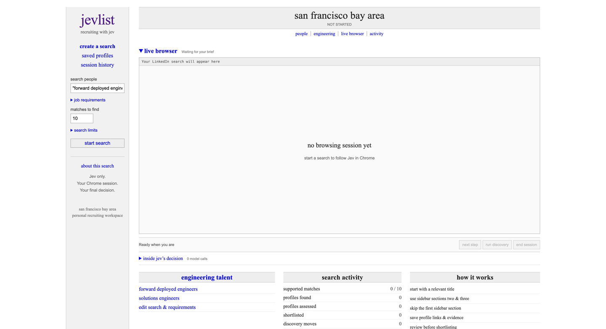

# Jev Recruiter

[](https://drive.google.com/file/d/1SKzLsTe4u5IbKBBO74TRC6K2s6Vd4uuE/view)

**[▶ Watch the 45 second demo](https://drive.google.com/file/d/1SKzLsTe4u5IbKBBO74TRC6K2s6Vd4uuE/view)** · Accelerated footage of Jev browsing profiles and saving potential matches.

**Give Jev a role. Watch it explore LinkedIn. Keep the profiles and the evidence.**

A local recruiting workspace built on [Browser Use’s Jev Ultrafast](https://github.com/browser-use/jev-ultrafast) and [Browser Harness](https://github.com/browser-use/browser-harness). Jev chooses where to go, screens professional titles, and assesses visible profile excerpts against your brief. The live browser sits at the top, open by default, inside a Craigslist inspired interface.

**The default provider is TypeSafe’s Jev.** You can explicitly select Morph instead. One provider handles all navigation, title screening, and evidence choices, with no secondary text model and no provider fallback.

[Quick start](#quick-start) · [How it works](#how-it-works) · [Read the loop](jev_ultrafast/recruiter.py) · [MIT license](LICENSE)

## What you can do

* Start from a relevant people search, rather than unrelated timeline posts.
* Follow relevant recommendations from the second and third profile sections in the sidebar. The first section is excluded.
* Save discovered profile URLs immediately, along with their source and title screening result.
* Review criterion findings beside quotations from the observed profile.
* Run toward a target number of potential matches, pause, step through decisions, and export JSON.
* Shortlist or pass candidates yourself.

The default brief looks for **forward deployed engineers or solutions engineers in the San Francisco Bay Area with 3 to 5 years of relevant professional engineering experience**. The search and requirements are editable.

## Quick start

You need Python 3.12 or newer, [uv](https://docs.astral.sh/uv/), Chrome with a signed in LinkedIn session, and a [TypeSafe API key](https://docs.typesafe.ai/introduction) or a [Morph API key](https://docs.morphllm.com/api-reference/endpoint/singleshot).

```bash
git clone https://github.com/skeptrunedev/jev-recruiter.git
cd jev-recruiter
uv sync
cp .env.example .env
```

Set your key in `.env`:

```dotenv
DECISION_PROVIDER=typesafe
TYPESAFE_API_KEY=your_typesafe_api_key
TYPESAFE_MODEL=jev-latest
RECRUITING_VIEWPORT_WIDTH=2048
RECRUITING_VIEWPORT_HEIGHT=1280
```

To use Morph for the same choice contract, set these values instead. A TypeSafe key is not required in this mode:

```dotenv
DECISION_PROVIDER=morph
MORPH_API_KEY=your_morph_api_key
MORPH_MODEL=morph-systemone-v1
MORPH_API_URL=https://api.morphllm.com/v1/singleshot
```

TypeSafe requests go to `https://api.typesafe.ai/v1/systemone`. Morph uses the configured `MORPH_API_URL`, defaulting to its documented singleshot endpoint above. Both receive the same indexed `state` and `questions`. Only the endpoint, credential, and configured model change. Invalid responses stop the run rather than switching providers. Morph availability depends on that endpoint being deployed and accessible with your key. Restart the server after changing provider settings. Saved runs identify the configured provider and model.

Model connection errors and temporary HTTP 429, 500, 502, 503, 504, or 529 responses share a limit of ten attempts with exponential backoff (capped at 20 seconds between attempts). Each attempt sends the same model input. Browser actions are never retried, and stale page guards still apply before execution. The model call counter counts logical decisions, so transport retries can make the number of HTTP requests higher.

Connect Chrome and start the app:

```bash
uv run browser-harness --doctor
uv run jev
```

Open **http://127.0.0.1:8766**. Follow Browser Harness’s connection instructions and allow Chrome remote debugging when prompted. Sign into LinkedIn in that Chrome profile. The app shares your existing browser session; it does not collect your LinkedIn password.

Keep the browser wide enough to show LinkedIn’s right sidebar. The viewport defaults above provide room for those recommendations.

1. Edit the search and job requirements. Use one criterion per line, up to 20. Begin optional criteria with `Preferred:`.
2. Set the match target and search limits, then click **start search**.
3. Use **next step** or **run discovery**. Pause takes effect after the current request.
4. Inspect the saved profiles and evidence, make your shortlist, and **export results**.

## How it works

```text
job brief + visible page
           │
           ▼
    indexed observations
           │
           ▼
      Jev title screen ───→ save profile URLs
           │
           ▼
    Jev operation + target
           │
           ▼
  Browser Harness execution
           │
           ▼
    observed profile text
           │
           ▼
  Jev criteria + evidence choices
           │
           ▼
     your candidate review
```

**Choices, not generated browser code.** Navigation uses the upstream operation and target chooser. Jev selects an operation and compatible target in one request. The executor consumes only the selected operation’s target, maps it to an observed element, and checks freshness before acting. Model output never becomes a selector or executable code.

**Relevant paths through LinkedIn.** Jev screens visible professional titles before a profile can be opened. Relevant recommendations in sidebar sections two and three take priority over returning to search results. Jev can select an observed Next button to continue through people search pages. Section identity is checked again before a sidebar link is followed.

**Evidence you can inspect.** Assessment asks Jev to choose a status and an indexed excerpt for each criterion. Code resolves the quotation from observed text and validates that it exists. Profile evidence excludes sidebar text, so a recommendation card cannot become evidence about the person being assessed. Unknown information remains unknown.

**A browser you can follow.** Screenshots show the current page in the workspace. Jev consumes structured observations, not those screenshots. Browser Harness provides the Chrome connection; the app adds observations, guarded execution, scrolling, and a bounded recruiting loop. Selected profiles open in owned tabs that preserve their source position.

## What a match means

A `potential_match` means Jev marked every required criterion as met and supplied observed quotations. It is **not an independently verified qualification or a hiring decision**. A quotation can be real while the model’s interpretation is wrong, especially when adding years across multiple jobs. Check dates, overlapping roles, location, and relevance yourself before shortlisting.

The target counter counts these potential matches. Unknown findings do not count. Profile, discovery, and model call limits can stop a run before the target is reached. The interface samples at most seven visible screens per profile; collapsed sections and unseen experience may be missed. A completed run does not prove every candidate meets the brief.

The recruiting flow navigates and scrolls. It does not send messages, connection requests, likes, or comments. Profile visits follow your LinkedIn visibility settings.

## Local data

Discovered URLs, screening results, assessments, your review decisions, and the activity trail are saved under ignored `artifacts/recruiting/`. Export results before starting another session. Refreshing the page retains the current server session; restarting the server does not resume an earlier run. Saved JSON files remain on disk.

Your brief and observed profile text are sent to the configured provider, TypeSafe or Morph, for model decisions. Credentials stay on the server in ignored `.env`. Keep personal recruiting exports and raw recordings out of source control.

## Small enough to read

| File | Responsibility |
| --- | --- |
| [recruiter.py](jev_ultrafast/recruiter.py) | Recruiting loop, limits, saved profiles, and review state |
| [discovery_model.py](jev_ultrafast/discovery_model.py) | Jev title relevance screening |
| [recruiting_model.py](jev_ultrafast/recruiting_model.py) | Jev criterion and evidence choices |
| [model.py](jev_ultrafast/model.py) | Upstream operation and target chooser |
| [snapshot.js](jev_ultrafast/snapshot.js) | Indexed elements, profile text, sidebar sections, and freshness guards |
| [browser.py](jev_ultrafast/browser.py) | Browser connection and execution |
| [demo.py](jev_ultrafast/demo.py) | Local HTTP server and recruiting API |
| [recruiter.js](jev_ultrafast/static/recruiter.js) | Live browser, controls, and candidate review interface |

The original generic agent remains in [agent.py](jev_ultrafast/agent.py) for reference. Its text helper is not exposed by the recruiting server. The inherited Flights examples and measurements describe the upstream agent, not recruiting performance.

## Development

```bash
uv run ruff check .
uv run pytest
node --check jev_ultrafast/static/recruiter.js
node --check jev_ultrafast/static/app.js
node --check jev_ultrafast/snapshot.js
uv build
```

Unit tests simulate browser and model responses and never call paid APIs.

`uv run python scripts/check_guards.py` exercises real browser controls on local fixtures without model calls. With Browser Harness connected and `.env` configured, `uv run --env-file .env python scripts/check_recruiting_jev.py` makes paid Jev calls against synthetic local pages. It checks profile choice, evidence, URL persistence, and saved review state without visiting LinkedIn.

## Credits and license

Adapted from [browser-use/jev-ultrafast](https://github.com/browser-use/jev-ultrafast), using [Browser Harness](https://github.com/browser-use/browser-harness) and [TypeSafe’s Jev](https://docs.typesafe.ai/introduction). The original Browser Use copyright and [MIT license](LICENSE) are retained.
